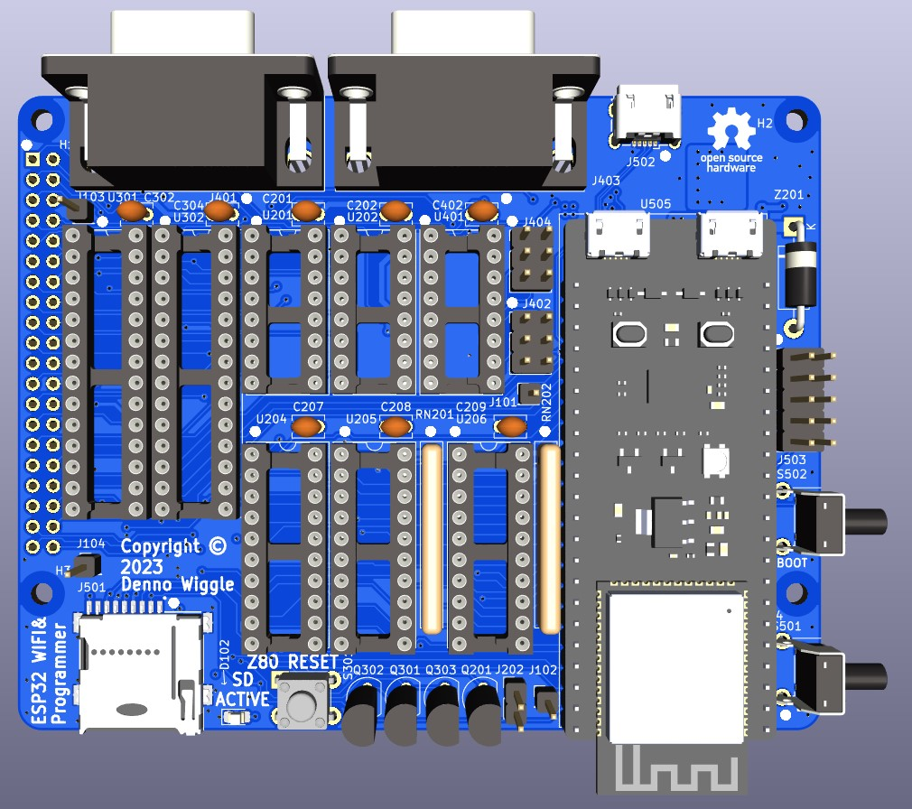

# ESP32_Interface
Facilitate learning the Z80 Retro! hardware and software.

## Description
This project adds a WiFi interface to the Z80 Retro! It has been used to facilitate telnet to the Z80 serial port, and programming the Z80 Retro! Flash memory via serial or telnet xmodem or a web interface.

## Top View

## Bottom View

## ESP32 Interface Board Rev 1.0 Release Notes

1. The 'output' directory contains the BOM, netlist, and PDF schematic.

2. Board design used KiCad 7.0.2.

3. Silkscreen box on back side should extend around R501.

4. Holes for U505, the ESP32 module, are tight but it is possible to fit the module in. Larger pin holes would be preferred.

