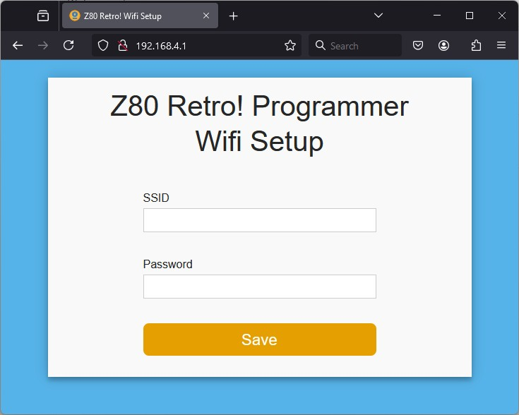
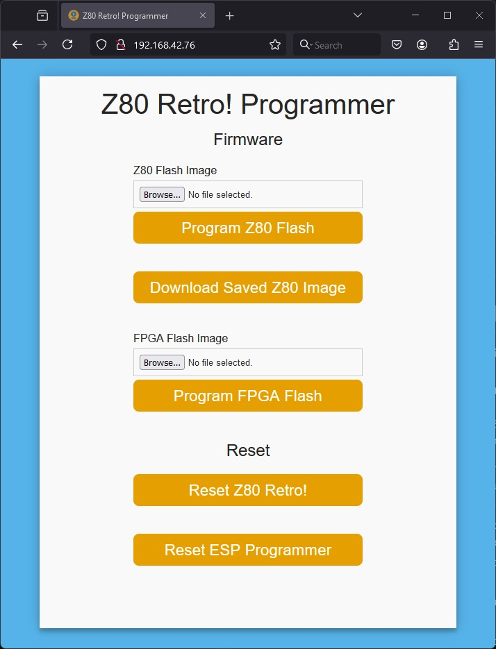
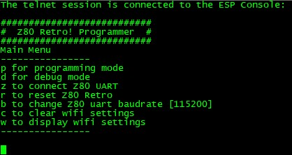
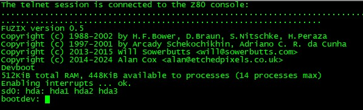

# ESP32 Z80 Retro! Programmer Software
Facilitate learning the Z80 Retro! hardware and software.

## Information:
The ESP32-S3 SW is in a platformio project format. If using VS Code there is a platformio plugin. Upon opening the project folder the project should self configure.

## Programming
* To program the board use the USB JTAG port on the module.
  - First upload the filesystem.
  - Then upload the code.
  
## WiFi Setup
* On first boot the module enters WiFi host AP mode.
  - Connect local computer to WiFi network "Z80-programmer" with password "Z80-Retro!"
  - Assign local computer IP address 192.168.4.10
  - Z80-Retro! WiFi setup IP address is 192.168.4.1
  - Open a webpage at address http://192.168.4.1 to set the WiFi parameters for WiFi client mode in the local network environment.
  - Power cycle.
  

## Web Page Use
* On the local WiFi router find the new IP address that the DHCP server assigned.
* Connect local computer to local WiFi network
* Open webage and enter the IP address assigned by DHCP server to the Z80-Programmer! 

## Remote Wireless Console - to ESP32 Z80 Programmer!
* There is Telnet console access to the ESP32 Z80-Programmer at the same IP address on port 2323

## Remote Wireless Console - to Z80 Retro! Console Port
* There is Telnet console access to the Z80 Retro at the same IP address on port 23
* Connect the Z80 Retro Console port to the first ESP32 9 pin DIN. It uses the same cable as used originally in the Z80 Retro project.
* Using console access to the ESP32 Z80 Programmer configure the baud rate to match thhat of the Z80 Programmer.

